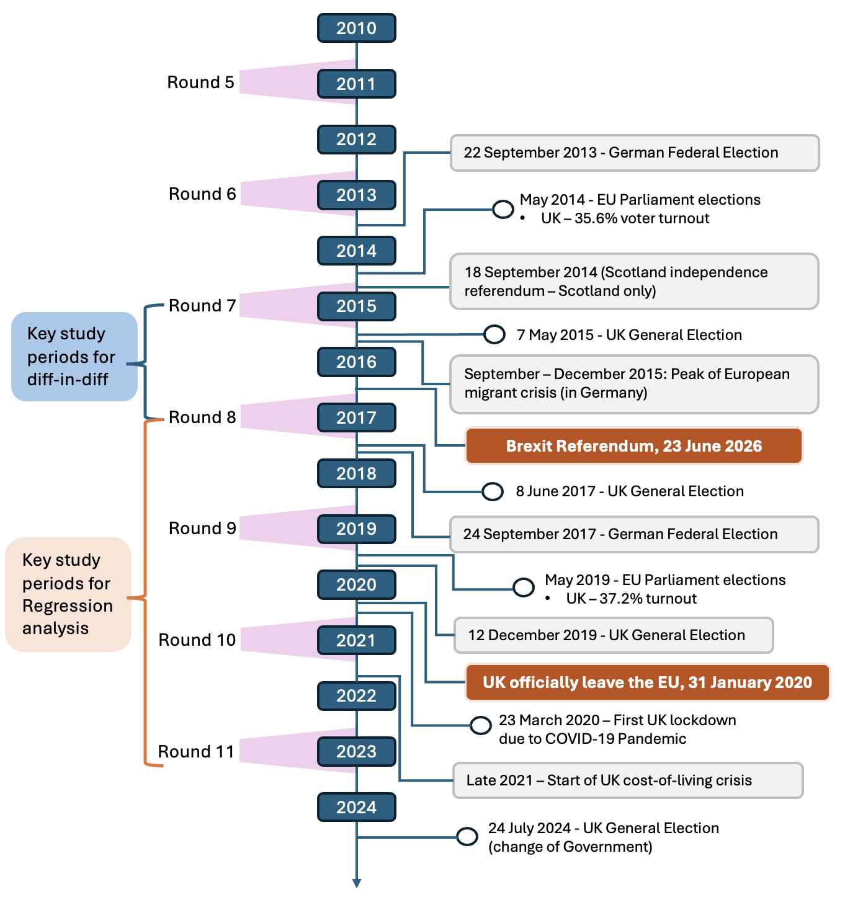

# Modelling changing parliamentary trust in the UK within the European Social Survey (ESS)

### Underlying code for thesis analysis

### UC3M - Master in Computational Social Sciences - 2024/25

------------------------------------------------------------------------

### Background

This repository contains the scripts and some direct model outputs from my Trabajo Fin de Máster (TFM). The final paper is available on request. However, the data cleaning, analysis and modelling have all been made available to assist others using ESS data.

Users should be able to download each script and run through the code on their own. Before running any scripts, you must download ESS datafile and save it within a "Data" folder in the R project. I recommend manually downloading through the ESS data wizard. The *essurvey* R package is no longer maintained and not functional.

Key links to download data:

-   [ESS Datafile Builder (wizard)](https://ess.sikt.no/en/){.uri} - to choose variables, survey rounds and countries. Also has a 'variable search function'.

-   Or, [search through the full questionnaires](https://www.europeansocialsurvey.org/methodology/ess-methodology/source-questionnaire){.uri} for each round.

------------------------------------------------------------------------

### Structure of this repository

This repository contains 6 scripts, as follows:

1.  `Dataframe creation_ESS.Rmd`

    *A simple starter to read in your data, select target variables and perform basic counts to check data availability.*

2.  `Univariate analysis.Rmd`

    *A script outlining weighting methodology decisions in ESS and performing weighted analysis of each trust variable, by country and round. Includes functions to calcualate weighted means over time and between countries, then create plots to make country-level comparisons over time.*

3.  *`Multivariate analysis and var clean.Rmd`*

    *Provides data quality checks on all covariates, then recodes all variables to be suitable for the regression model (mostly into binary of 3/4 level factor variables). The analysis then plots comparisons of trust in the UK against trust in the EU for each covariate subgroup (as a weighted mean and a standardised value from the mean).*

4.  *`Difference-in-difference.Rmd`*

    *A guide to run the diff-in-diff between the UK and Germany for the 'Trust in the EU Parliament' variable around the Brexit Referendum.*

5.  `Regression analysis.Rmd`

    *Script to setup and transform target variable, run regression models with 2 targets (raw difference + log(ratio difference). Includes imputation of missing data and lasso regularisation. Models are run with and without time interactions then results shared in various plots.*

6.  *`Target variable and response rates.Rmd`*

    *This models the transformation of the trust ratio and looks at decreasing UK response rates over time. It is explanatory only to explore models validity.*

Each script is connected as they call one another. To run any script, ensure you load your ESS data in the "Data" folder, then run run your selected code.

Additionally:

-   The *'Outputs'* folder contains excel sheets of regression models outputs by target variable.

-   The *'Script outputs (html)'* folder contains all html outputs from the Rmd files. These can be referred to to see outputs and plots as well.

------------------------------------------------------------------------

### Additional context for the analysis into UK/EU trust:

If you want to run through all of the analysis. The timeline below provides approximations on how the ESS fieldwork rounds line up with calendar year and against other political events in the UK and Germany. This is used to contextualise the for the difference-in-difference and regression models. Note that fieldwork times vary, but the ESS is run every second year with fieldwork times approximated to occur mostly between September of one year and finish in January of the following year.

**Figure.** Outline of ESS fieldwork rounds, analysis periods and significant events

**Note: If reusing code from this repository, you are liable to perform your own checks on model output and accuracy**
